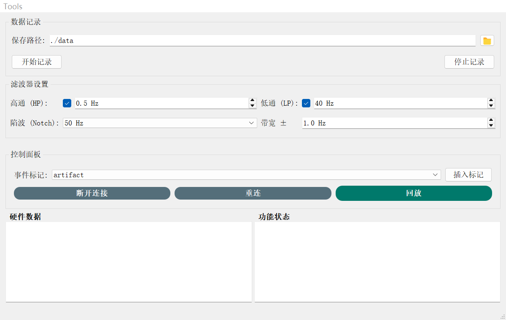
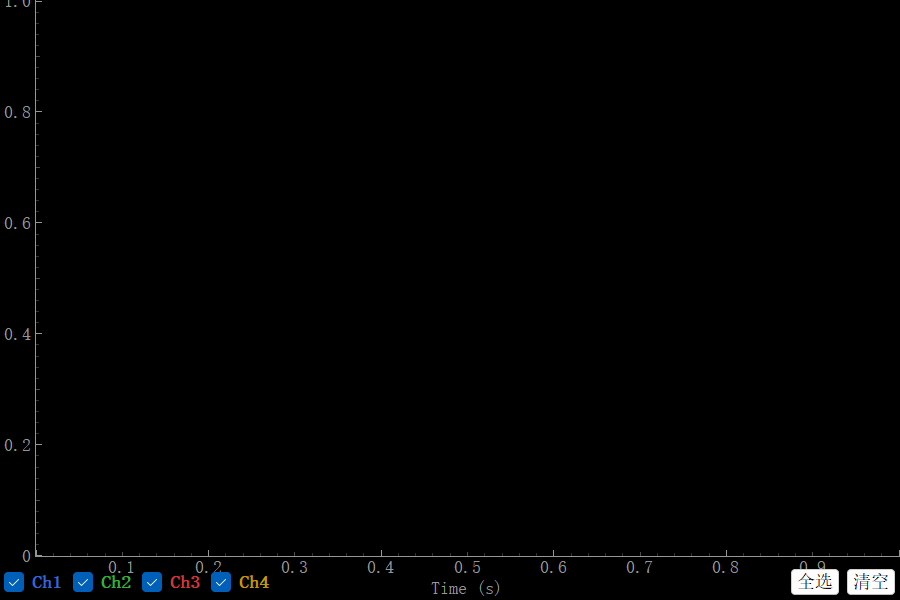
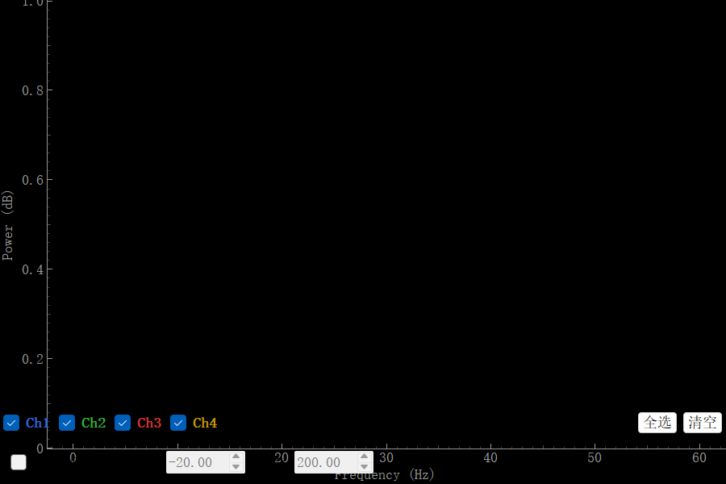

# EEG 波形显示 App（新协议简化版）

这是一个独立版本，面向 4 通道 USB 虚拟串口采集设备。它与仓库中的“简化版（64 通道 WiFi/UDP）”使用不同的数据协议，请按自己的设备选择对应文件夹。

## 安装与启动

在 Windows 上安装 Python 3.9 或更新版本，在本文件夹打开 PowerShell：

```powershell
python -m venv .venv
.\.venv\Scripts\Activate.ps1
python -m pip install -r requirements.txt
python app.py
```

程序启动后会打开主控制、波形和功率谱窗口。没有连接设备时，窗口仍会显示，但不会出现实时脑电波形。

## 采集协议

- 主数据通道使用 USB 虚拟串口，默认波特率为 115200，采样率为 250 Hz。
- 当前解析格式为 22 字节数据包：4 字节包头 `AA FF F1 10`、4 通道小端序 int32 数据，以及 2 字节校验值。
- 程序会尝试自动检测串口；也可以在启动前设置 `BCI_SERIAL_PORT`，例如 `$env:BCI_SERIAL_PORT="COM4"`。
- `lsl_config.py` 中保留可选 LSL 接收所需的流配置。无需连接设备或加载 LSL 数据即可打开界面。

请先确认设备使用的包格式与上述参数一致。其他版本的 WiFi/UDP 包格式不能直接用于此串口版。

## 使用说明

1. 启动后，在主窗口查看串口状态；波形和功率谱窗口会同时打开。
2. 连接兼容设备后，程序接收数据并更新曲线；主窗口可以设置滤波、标记和记录路径。
3. 回放时选择本程序支持的 EDF 或 CSV 文件。程序也可将采集内容记录到本机。
4. 本仓库不提供 EEG 示例文件，记录文件保留在本机，不要提交到 GitHub。

为避免公开个人设备信息，仓库不包含原目录中的 COM 端口、设备描述和 MAC 地址配置。首次运行使用自动检测；本机运行产生的 `ui_config/user_config*.json`、窗口状态和 `data/` 目录已列入忽略规则。

此公开版本只保留采集、波形/功率谱显示、记录与回放所需代码。实验范式训练/测试和 Alpha 校准面板及对应入口已从公开版移除；实验脚本、离线分析代码、校准参数与 EEG 数据均未上传。

## 界面截图

截图展示空闲启动界面，没有使用真实 EEG 数据。

### 主控制窗口



### 波形窗口



### 功率谱窗口



## 主要文件

- `app.py`：启动入口。
- `serial_receiver.py`、`lsl_config.py`：串口接收和协议参数。
- `controller.py`、`data_processor.py`：采集数据分发和处理。
- `ui.py`、`curvesForm.py`、`spectrumForm.py`、`ui_config/`：主界面、波形/频谱界面及 UI 文件。
- `dSPx.py`、`filterButter.py`：滤波处理。
- `edfSaver.py`、`csvSaver.py`、`playback.py`：本地记录和回放。
