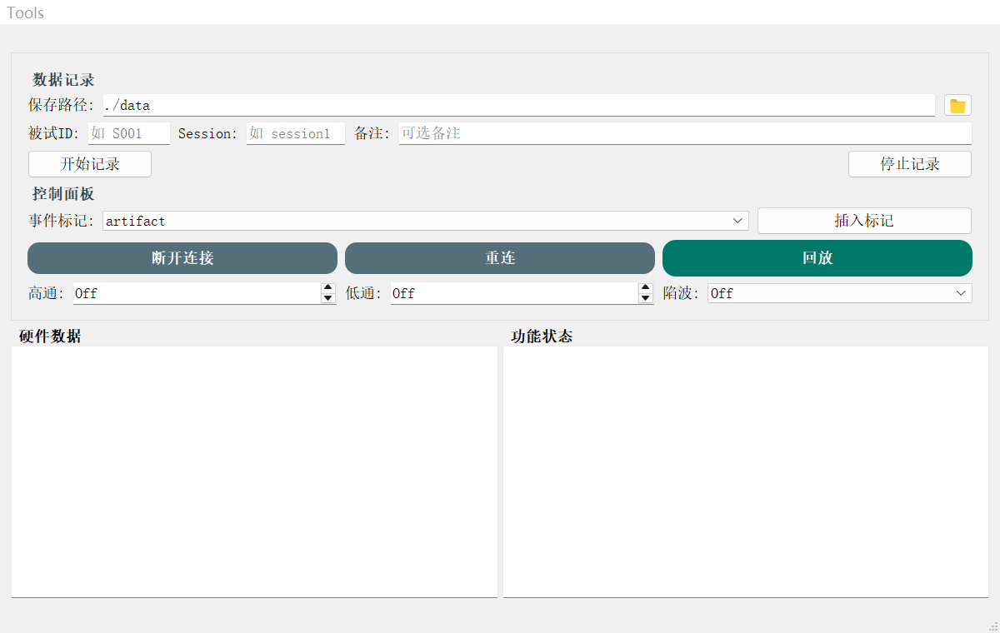
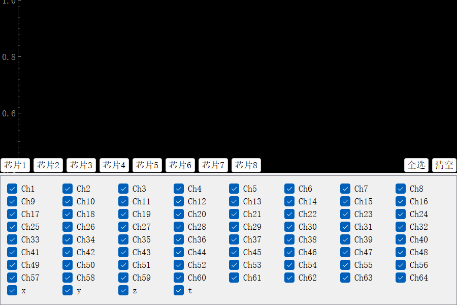
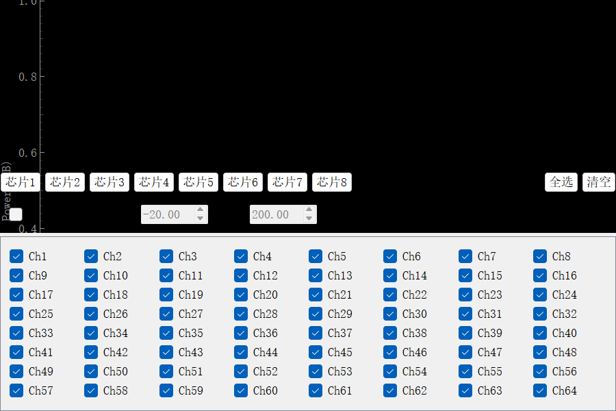

# EEG 波形显示 App（简化版）

本文件夹整理自 `bci-python（simplify）`。启动后会打开主控制窗口、64 通道脑电波形窗口和功率谱窗口。程序可接收设备通过 WiFi/UDP 发送的脑电数据，也可在界面中加载本程序格式的 EDF/CSV 文件回放。此版本隐藏了未附带实验脚本的训练区域。

## 安装与启动

在 Windows 上安装 Python 3.9 或更新版本，然后在本文件夹打开 PowerShell：

```powershell
python -m venv .venv
.\.venv\Scripts\Activate.ps1
python -m pip install -r requirements.txt
python app.py
```

`requirements.txt` 已列出启动和运行所需的第三方模块：PyQt5、NumPy、SciPy、pyqtgraph、Matplotlib、pylsl 和 pyedflib。仓库内已包含这些模块所调用的本项目 Python 文件及 `.ui`、滤波配置文件；无需复制原项目的实验范式、分析脚本或数据。若安装后仍提示缺少依赖，可在同一虚拟环境运行 `python -m pip check` 检查安装状态。

程序启动后会监听 UDP 端口 `8080`。没有连接采集设备时，窗口仍会打开，但不会出现实时波形。需要实时显示时，让兼容的 64 通道设备向运行本程序的电脑发送符合 `lsl_config.py` 和 `udp_receiver.py` 中格式的数据包。

## 使用

1. 在主窗口查看设备状态，波形和功率谱窗口会随程序启动。
2. 收到实时数据后，在波形窗口勾选需要显示的通道；可在主窗口设置高通、低通和陷波滤波。
3. 需要回放时，使用主窗口的回放按钮选择本程序格式的 EDF 或 CSV 文件。仓库不提供任何被试数据或示例记录。
4. 需要记录时，在主窗口设置保存位置并开始记录。当前记录功能写入 EDF；CSV 可用于回放兼容格式的文件。生成的 EEG 文件保留在本机，不应提交到仓库。

`ui_config/filter_presets.json` 保存默认滤波方案。个人设备配置和窗口状态在本机运行后生成，已被 `.gitignore` 排除。

## 启动界面

以下为程序启动后的界面示意。未连接采集设备时，波形和功率谱区域为空白；截图没有使用真实 EEG 数据。

### 主控制窗口



### 波形与通道选择



### 功率谱与通道选择



## 主要文件

- `app.py`：启动入口。
- `ui.py`、`curvesForm.py`、`spectrumForm.py`、`ui_config/`：主界面、波形与频谱显示。
- `controller.py`、`data_processor.py`、`udp_receiver.py`、`lslReceiver.py`：数据接收和界面分发。
- `dSPx.py`、`filterButter.py`：实时滤波。
- `edfSaver.py`、`csvSaver.py`、`playback.py`：本地记录与回放。

本文件夹未包含实验范式、训练与分类脚本、Alpha 校准模块、模型权重以及 EEG 记录数据。
